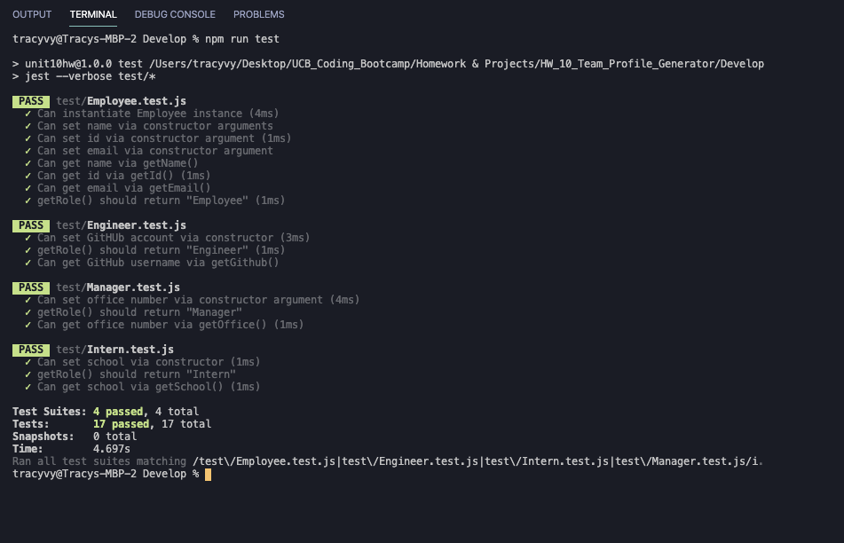

# Unit 10 OOP Homework: Template Engine - Employee Summary

A command line application that will prompt user for employee's details. Team manager, engineers and interns have a mixed selection of data.

## Dependencies

The dependencies are, [jest](https://jestjs.io/) for running the provided tests, and [inquirer](https://www.npmjs.com/package/inquirer) for collecting input from the user.

## Ouput images

